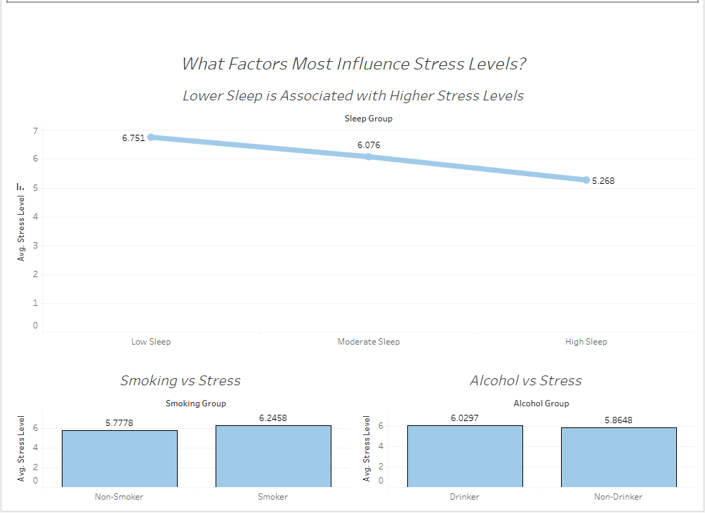
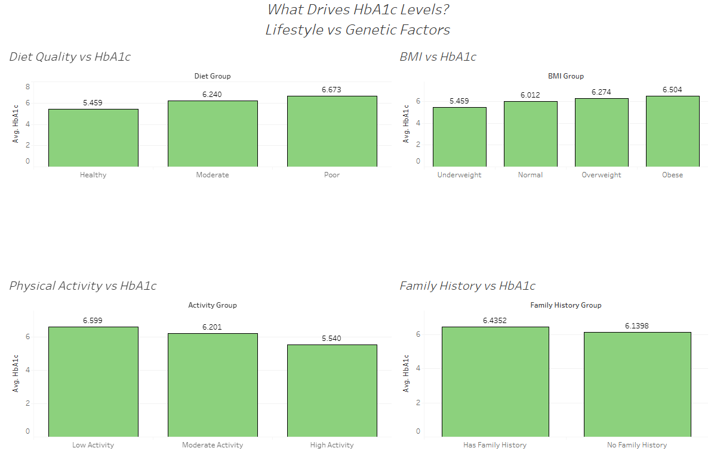
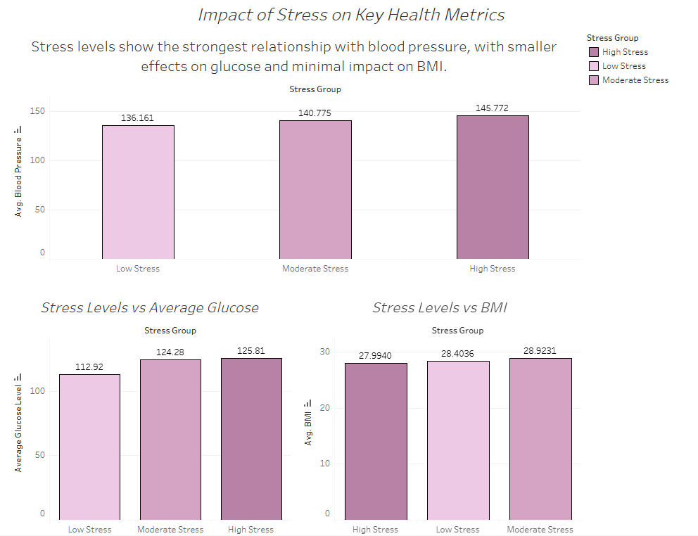
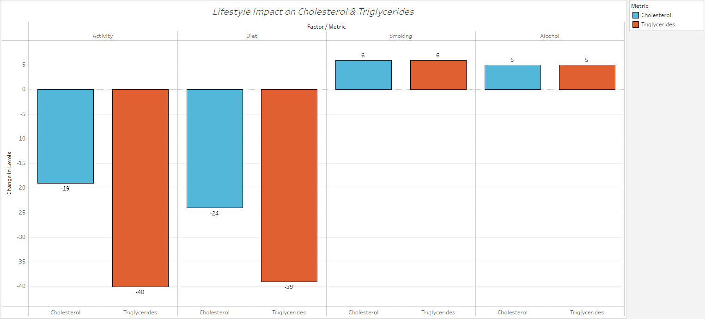

# Healthcare SQL Analysis: Stress & Health Metrics

## Overview
This project analyzes over 30,000 patient records using SQL to identify key factors influencing stress levels and related health outcomes.

The goal is to uncover relationships between lifestyle behaviors and important health indicators such as blood pressure, glucose, BMI, cholesterol, and HbA1c.

---

## Objectives
- Determine whether sleep, smoking, or alcohol has the strongest impact on stress
- Analyze how stress relates to key health metrics (blood pressure, glucose, BMI)
- Evaluate how lifestyle factors influence cholesterol and triglyceride levels
- Explore relationships between lifestyle behaviors and HbA1c levels

---

## Tools Used
- MySQL
- SQL (data cleaning, transformation, and analysis)
- Tableau (data visualization and dashboard creation)

---

## Data Cleaning Process
- Removed irrelevant columns (`random_notes`, `noise_col`)
- Replaced invalid physical activity values with 0
- Handled missing values:
  - Numerical → replaced with averages
  - Categorical → replaced with "Unknown"
- Identified and removed duplicate records
- Applied outlier handling to ensure realistic medical ranges

---

## Key Findings
- Sleep duration had the strongest relationship with stress levels  
- Lower sleep was associated with higher stress  
- Higher stress levels were linked to increased blood pressure  
- Glucose levels increased with stress, but less significantly relative to its range  
- BMI showed minimal variation across stress levels  
- Lifestyle factors had a stronger influence on HbA1c than family history  

---

## Dashboard
A Tableau dashboard was created to visualize the relationship between stress and key health metrics.

---

This dashboard analyzes key lifestyle factors influencing stress levels, including sleep, smoking, and alcohol consumption.

Sleep duration shows the strongest relationship with stress levels, with individuals reporting lower sleep experiencing significantly higher average stress. Smoking is also associated with increased stress, though the difference is smaller in comparison. Alcohol consumption shows minimal variation between groups, suggesting a weaker relationship with stress levels.

Overall, sleep appears to be the most impactful factor among those analyzed, indicating its importance in managing stress.

##Dashboard #2

---

This dashboard examines the factors influencing HbA1c levels, comparing lifestyle behaviors such as diet, physical activity, and BMI with genetic factors like family history.

Diet quality shows a strong relationship with HbA1c levels, with poorer diets associated with higher average HbA1c. BMI also demonstrates a clear upward trend, with higher BMI categories corresponding to increased HbA1c levels.

Physical activity shows an inverse relationship, where higher activity levels are associated with lower HbA1c, indicating its protective effect on metabolic health. In contrast, family history shows only a small difference between groups, suggesting a weaker influence compared to lifestyle factors.

Overall, the analysis indicates that lifestyle behaviors have a more significant impact on HbA1c levels than genetic factors, highlighting the importance of diet and physical activity in managing long-term health outcomes.

##Dashboard #3

---

This dashboard examines the relationship between stress levels and key health indicators, including blood pressure, glucose, and BMI.

Blood pressure demonstrates the strongest and most consistent relationship with stress, increasing steadily across all stress groups. This clear upward trend suggests a direct and meaningful impact of stress on cardiovascular health.

Glucose levels also rise with increasing stress and show a larger absolute change. However, when considered relative to the broader range of glucose values, the impact is less pronounced, indicating a weaker overall relationship compared to blood pressure.

BMI remains relatively stable across stress levels, showing minimal variation and suggesting that stress does not directly influence body composition, but may instead affect it indirectly through lifestyle factors.

Overall, the findings highlight blood pressure as the most sensitive indicator of stress, with glucose showing a moderate response and BMI demonstrating little to no direct association.

##Dashboard #4

---

This dashboard analyzes the impact of key lifestyle factors on cholesterol and triglyceride levels, including physical activity, diet, smoking, and alcohol consumption.

Physical activity and diet show the most significant impact, with both associated with substantial decreases in cholesterol and triglyceride levels. These findings suggest that improvements in diet quality and increased physical activity are strongly linked to better cardiovascular health outcomes.

In contrast, smoking and alcohol consumption show slight increases in both cholesterol and triglycerides, indicating a negative but less pronounced effect compared to lifestyle improvements.

Overall, the analysis highlights that positive lifestyle behaviors, particularly diet and physical activity, have a greater influence on improving cholesterol and triglyceride levels than the negative effects introduced by smoking and alcohol.

## File Structure
- `analysis.sql` → Full SQL workflow (data cleaning + analysis)

---

## Key Skills Demonstrated
- Data cleaning and preprocessing in SQL  
- Aggregation and analytical queries  
- Translating raw data into actionable insights  
- Data storytelling through visualization (Tableau)  
